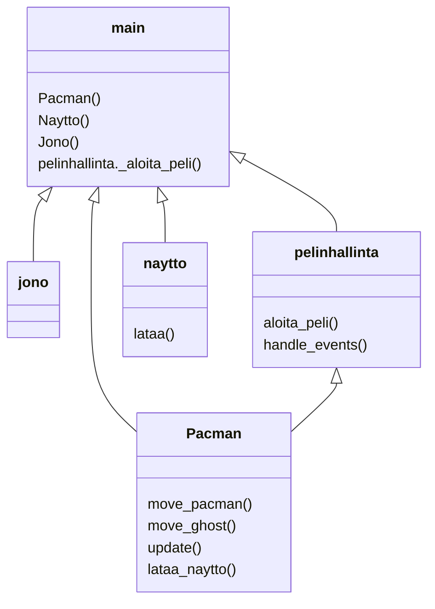
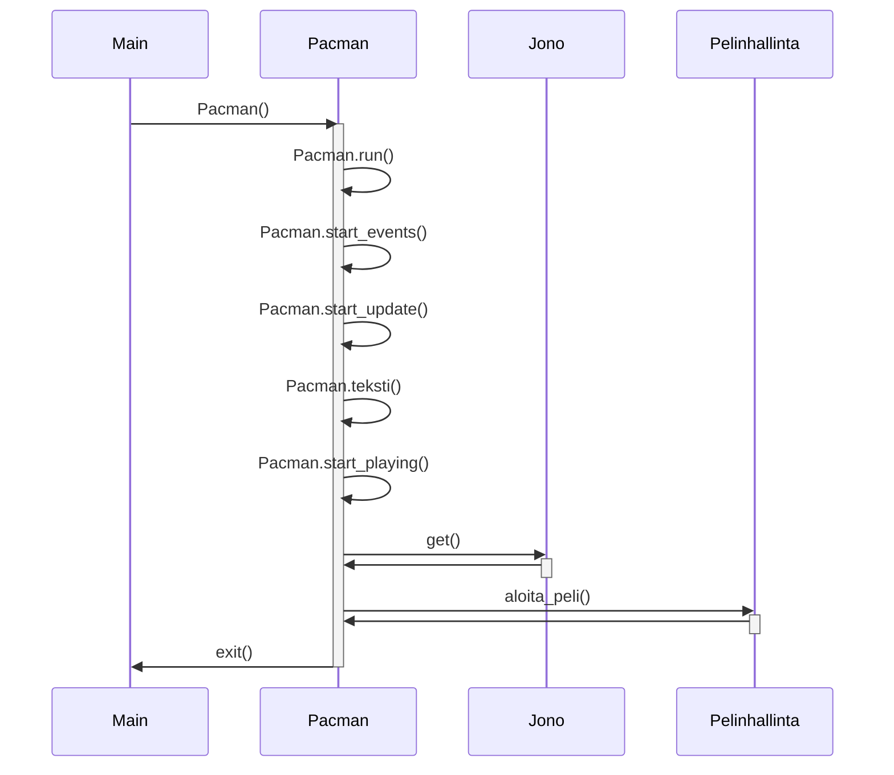

```mermaid
classDiagram
  main<|--Pacman
  main<|--jono
  main<|--pelinhallinta
  main<|--naytto
  pelinhallinta<|--Pacman

  class main{
    Pacman()
    Naytto()
    Jono()
    pelinhallinta._aloita_peli()

  }

  class jono{
    

  }

  class pelinhallinta{
    aloita_peli()
    handle_events()

  }

  class naytto{
    lataa()

  }

   class Pacman{
  move_pacman()
  move_ghost()
  update()
  lataa_naytto()

  }


```

```mermaid

sequenceDiagram
participant Main
participant Pacman
participant Jono
participant Pelinhallinta

Main->>Pacman: Pacman()
activate Pacman
Pacman->>Pacman: Pacman.run()
Pacman->>Pacman: Pacman.start_events()
Pacman->>Pacman: Pacman.start_update()
Pacman->>Pacman: Pacman.teksti()
Pacman->>Pacman: Pacman.start_playing()
Pacman->>Jono: get()
activate Jono
Jono->>Pacman: 
deactivate Jono
Pacman->>Pelinhallinta: aloita_peli()
activate Pelinhallinta
Pelinhallinta->>Pacman: 
deactivate Pelinhallinta
Pacman->>Main: exit()
deactivate Pacman


```
