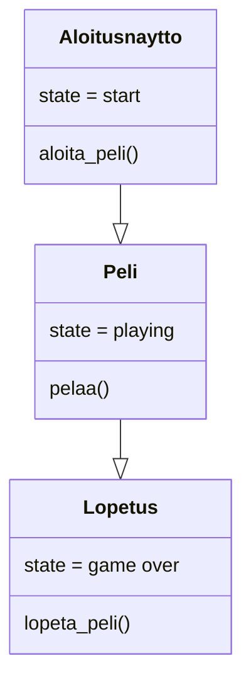
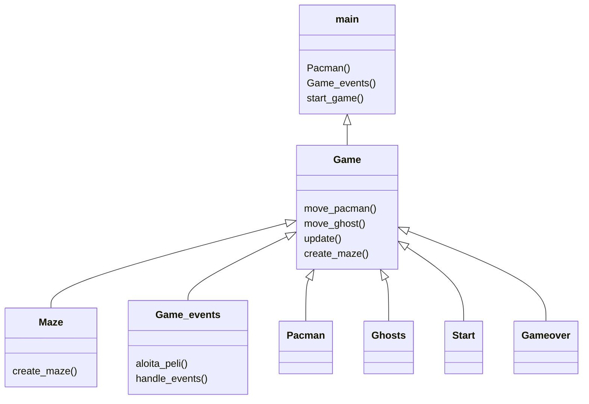
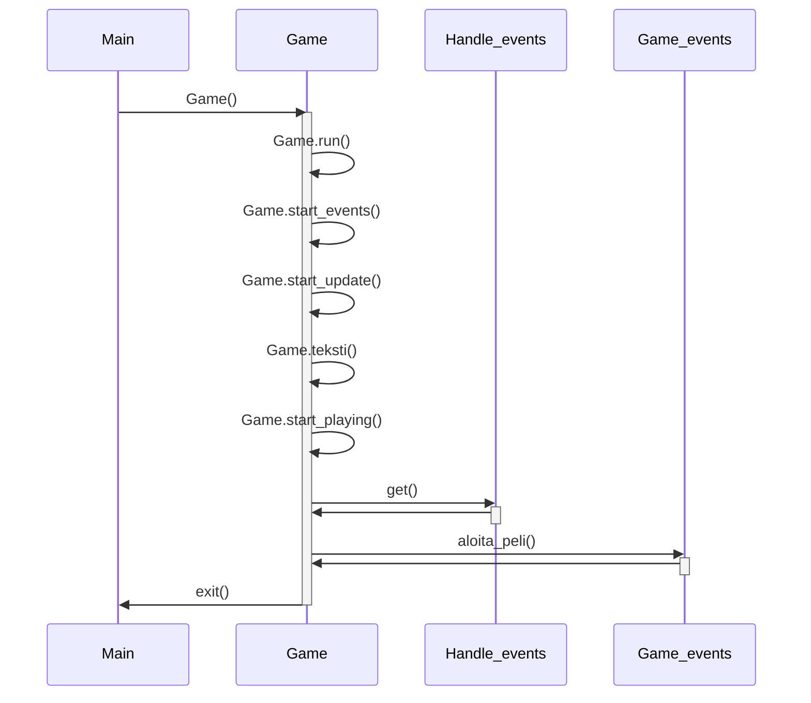

# Käyttöliittymä

Käyttöliittymä sisältää kolme erillistä näkymää:

- Aloitusnäyttö
- Pelaaminen
- Lopetusnäyttö

Näitä eri osa-alueita pelissä kuvaa sen "state".
- Start
- Playing
- Game over

# Pelin rakenne jakautuu eri rakenteisiin

# Pelin kulku
 
 Peli aloitetetaan alkunäytöstä jossa painamalla SPACE-nappia päästään pelin seuraavaan tasoon: pelinäkymään.

