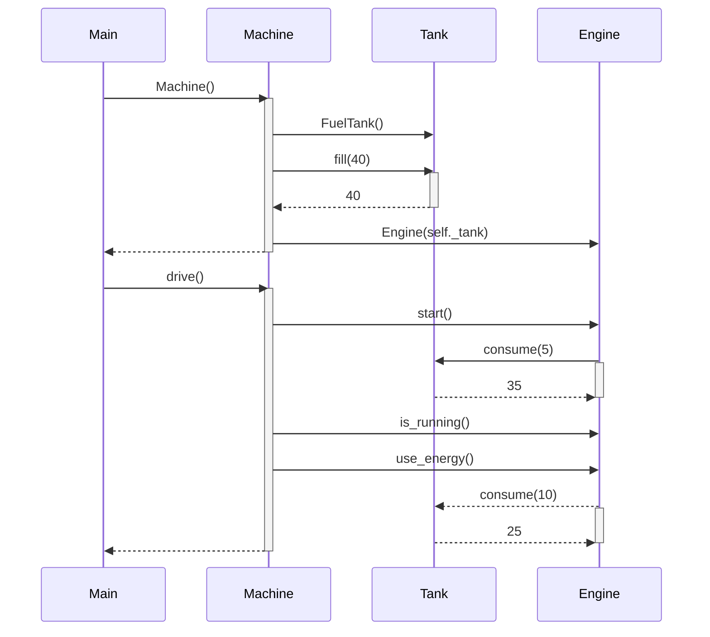

```mermaid
  
  sequenceDiagram
  participant Main
  participant Machine
  participant Tank
  participant Engine
  
  Main->>Machine: Machine()
  activate Machine
  Machine->>Tank: FuelTank()
  Machine->>Tank: fill(40)
  activate Tank
  Tank-->>Machine: 40
  deactivate Tank
  Machine->>Engine: Engine(self._tank)
  Machine-->>Main: 
  deactivate Machine
  Main->>Machine: drive()
  activate Machine
  Machine->>Engine: start()
  Engine->>Tank: consume(5)
  activate Engine
  Tank-->>Engine: 35
  deactivate Engine
  Machine->>Engine: is_running()
  Machine->>Engine: use_energy()
  Engine-->>Tank: consume(10)
  activate Engine
  Tank-->>Engine: 25
  deactivate Engine
  Machine-->>Main: 
  
  
  deactivate Machine
  
  
  


```
