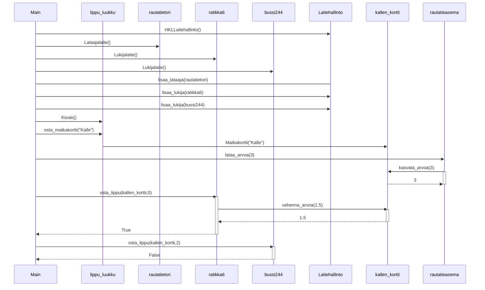

```mermaid
  sequenceDiagram
  participant Main
  participant lippu_luukku
  participant rautatietori
  participant ratikka6
  participant bussi244
  participant Laitehallinto
  participant kallen_kortti
  
  Main->>Laitehallinto: HKLLaitehallinto()
  Main->>rautatietori: Lataajalaite()
  Main->>ratikka6: Lukijalaite()
  Main->>bussi244: Lukijalaite()
  Main->Laitehallinto: lisaa_lataaja(rautatietori)
  Main->>Laitehallinto: lisaa_lukija(ratikka6)
  Main->>Laitehallinto: lisaa_lukija(bussi244)
  Main->>lippu_luukku: Kioski()
  Main->>lippu_luukku: osta_matkakortti("Kalle")
  lippu_luukku->>kallen_kortti: Matkakortti("Kalle")
  Main->>rautatieasema: lataa_arvoa(3)
  rautatieasema->>kallen_kortti: kasvata_arvoa(3)
  activate rautatieasema
  kallen_kortti-->>rautatieasema: 3
  deactivate rautatieasema
  Main->>ratikka6: osta_lippu(kallen_kortti,0)
  activate ratikka6
  ratikka6->>kallen_kortti: vahenna_arvoa(1.5)
  activate kallen_kortti
  kallen_kortti-->>ratikka6: 1.5
  deactivate kallen_kortti
  ratikka6-->>Main: True
  deactivate ratikka6
  Main->>bussi244: osta_lippu(kallen_kortti,2)
  activate bussi244
  bussi244-->>Main: False
  deactivate bussi244
  
  
  
  


```
